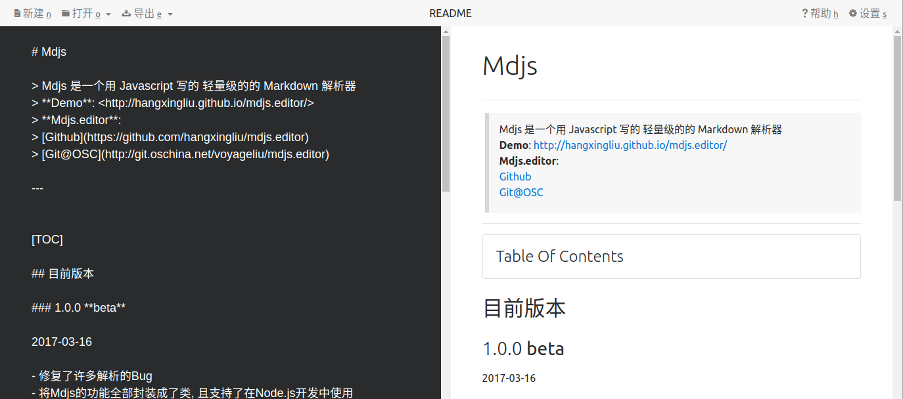

# Mdjs.editor

> 一个基于[`Mdjs`][mdjs]开发的Markdown在线编辑器   
> **演示页面**: <http://hangxingliu.github.io/mdjs.editor>
> 
> 欢迎大家参考学习,也望大家能够对本解析器中的不足或错误进行指正批评.

[mdjs]: https://github.com/hangxingliu/mdjs

---

[TOC]

## 截图

## 目前版本 

### 1.0.4

- 升级了`Mdjs`

更多更新日志请参阅: [CHANGELOG.md](CHANGELOG.md)

## 使用方法

1. 直接访问: <http://hangxingliu.github.io/mdjs.editor>  
2. 克隆当前仓库并检出`gh-pages`分支
	- `git clone https://github.com/hangxingliu/mdjs.editor.git`
	- `git checkout gh-pages`
3. 克隆当前仓库并构建源码(请先安装`node.js`与`npm`开发环境)
	- `git clone https://github.com/hangxingliu/mdjs.editor.git`
	- `npm i`
	- 构建生成的代码在`dist`目录下

## 相关组件

- [jQuery](http://jquery.com/)
- [Bootstrap](http://getbootstrap.com/)
	- [tether](http://tether.io/docs/welcome)
- [ionicons](http://ionicons.com/)
- [Mdjs][mdjs]

## Author (作者)

@hangxingliu (Liu Yue)   
[Github](https://github.com/hangxingliu)   
[码云Gitee](https://git.oschina.net/voyageliu)   

## License (开源协议)

[Apache Licence 2.0](LICENSE)