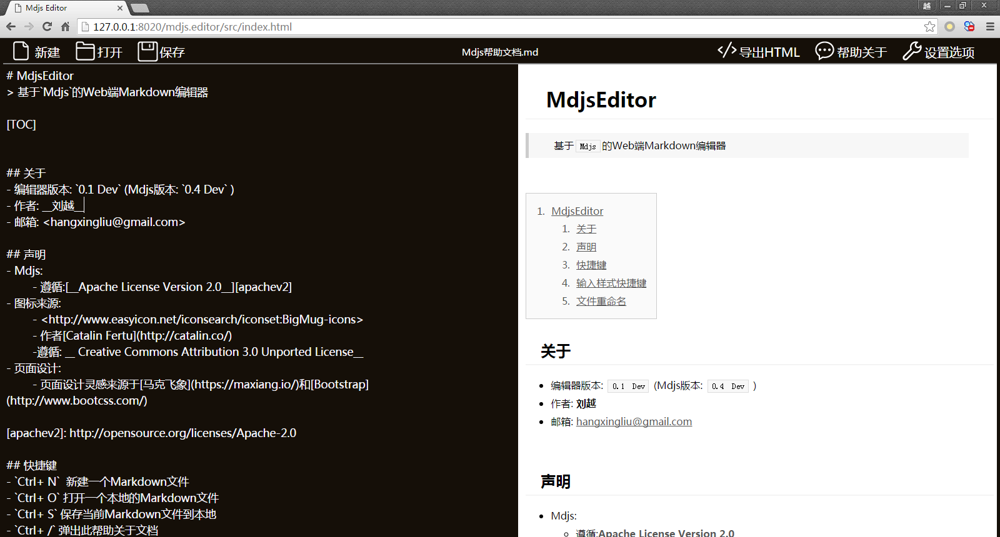
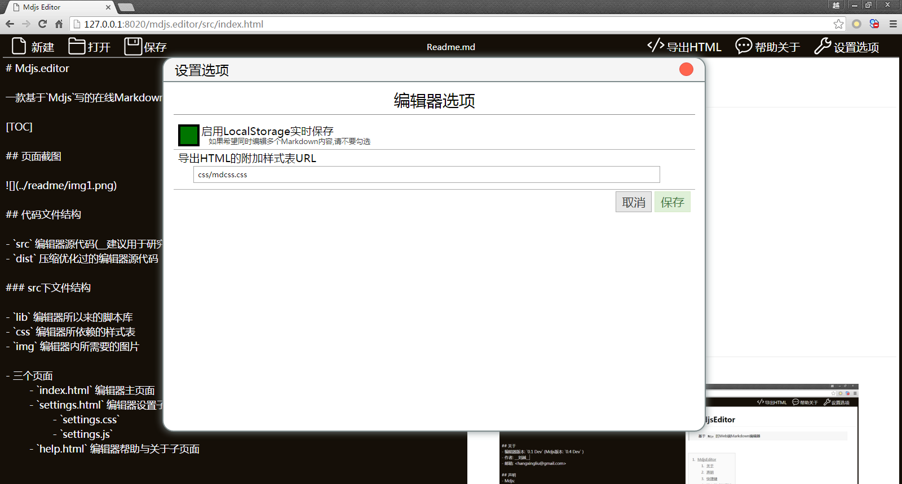

# Mdjs.editor
> 一款基于`Mdjs`写的在线Markdown编辑器

---
`2016年01月11日`

编辑器版本 `0.1 Dev` Mdjs 版本: (`0.4 Dev`)

欢迎大家参考学习,也望大家能够对本解析器中的不足或错误进行指正批评.

开发者: **刘越(HangxingLiu)**
 [@航行刘](http://weibo.com/chinavl)

[TOC]

## 开源声明

Mdjs遵循[Apache Licence 2.0](LICENSE)

> 允许使用在商业应用中,允许通过修改来满足实际需求(但需要在被修改的文件中说明).

## 页面截图




## 代码文件结构

- `src` 编辑器源代码(__建议用于研究学习__)
- `dist` 压缩优化过的编辑器源代码

### src下文件结构

- `lib` 编辑器所以来的脚本库
- `css` 编辑器所依赖的样式表
- `img` 编辑器内所需要的图片

- 三个页面
	- `index.html` 编辑器主页面
	- `settings.html` 编辑器设置子页面
		- `settings.css`
		- `settings.js`
	- `help.html` 编辑器帮助与关于子页面


- Toast消息显示组件(类似Android的显示一会儿的Toast组件)
	- `toast.css`
	- `toast.js`

- Dialog对话框组件
	- `dialog.css`
	- `dialog.js`

- 本地文件读写库(用于编辑器读写用户本地的Markdown文件)
	- `localio.js`
	
- LocalStorage内容配置读写脚本
	- `h5storage.js`

- 将Markdown生成的HTML转换为完整的HTML的导出脚本
	- `export.js`

- 编辑器输入框的历史记录功能脚本(撤销,重做)
	- `history.jq.js`

- 编辑器相关组件
	- `editor.css`
	- `editor.js`

- Markdown解析成的HTML的样式表
	- `mdcss.css`

### dist下文件结构变动

1. lib下面与编辑器页面相关的脚本(除了`jquery.min.js`外)均合并到`editor.all.js`
2. lib下的`h5storage.js`在合并到了`editor.all.js`内仍保留一份以便于`settings.html`页面引用
3. css下的编辑器相关的样式表均合并到`editor.all.css`


## 扩展开发可能涉及到的变量和函数

1. `window.nowFile` 目前正在编辑的Markdown内容的HTML5原生File对象
2. `window.shortcutMap`可以通过`shortcutMap[keyCode]=CallbackFunction`给编辑器绑上**Ctrl+_x_**类型的快捷键
3. **`onMenu_`**`new`/`open`/`save`/`export`/`help`/`settings` 分别对应了菜单栏的六个按钮的响应事件
4. `preview()` 这个方法可以马上预览编辑器输入框内的Markdown内容,并且将内容保存到LocalStorage如果没有禁用的话
5. `fileStatusChange(fileOrFileName)` 这个方法用于通知编辑器,当前正在编辑的Markdown文件有变化了,编辑器会同步文件名和`nowFile`
6. `showIframeDlg(title,url)` 显示一个大对话框,内置网页为**url**,标题为**title**
7. `LIOEvent.onDone = onReadMdDone`;`LIOEvent.onError = onReadMdError`;`LIOEvent.onAbort = onReadMdAbort`;这三个接口和实现的方法分别为当加载本地Markdown文件成功,失败,被中断.
	1. `onDone(markdownContent)`
	2. `onError(errInfo)`
	3. `onAbort()`
8. 一些编辑器元素的JQuery对象
	1. `filedlg` : 用于选择本地文件的`input[type=file]`
	2. `editorView` : 包裹编辑器输入框和预览区的`div`
		1. `editorView.undo()` : 撤销
		2. `editorView.redo()` : 重做
	3. `inputView` : 编辑器输入框`textarea`
	4. `outputView` : 编辑器预览区域`div`
9.  显示Toast消息:
	1. `Toast.text(text,[showTime])` 普通消息
	2. `Toast.warn(warnInfo,[showTime])` 警告消息
	3. `Toast.err(errInfo,[showTime])` 错误消息
10. Dialog对话框,HTML代码如下**[示例代码\_Dialog](#示例代码_Dialog)**
11. 读写存在LocalStorage内的内容标题和配置可使用`H5S`对象
	1. `H5S.content`
	2. `H5S.title`
	3. `H5S.settings`
	4. `H5S.getValue(settingKey)`

##  示例代码:

### 示例代码_Dialog

``` html

<div class="dialog_bg" style="/*display: none;*/">
	<div class="dialog" id="newdlg" style="display: none;">
	<div class="dialog_tt">对话框标题</div>
	<div class="dialog_bd">
		对话框消息<br/>
		<span class="dialog_warn">
			警告/出错消息
		</span>
		<input type="text" class="dialog_input" placeholder="输入框"/>
	</div>
	<div class="dialog_ft">
		<button class="dialog_ok" onclick="showNewFileDlg();">确定</button>
		<button class="dialog_cancel" onclick="hideDialog();">取消</button>
	</div>
</div>

```